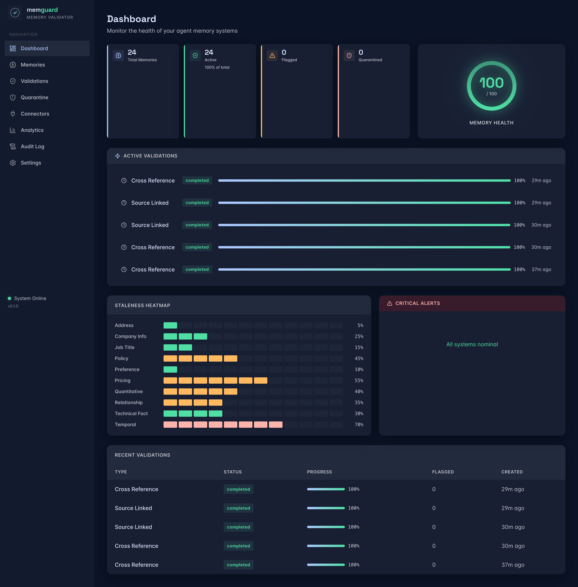
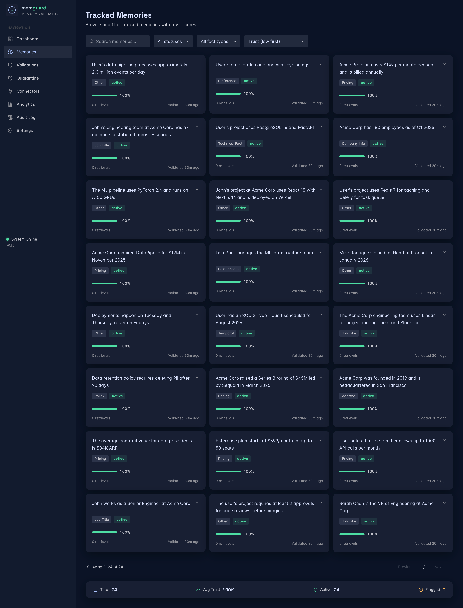
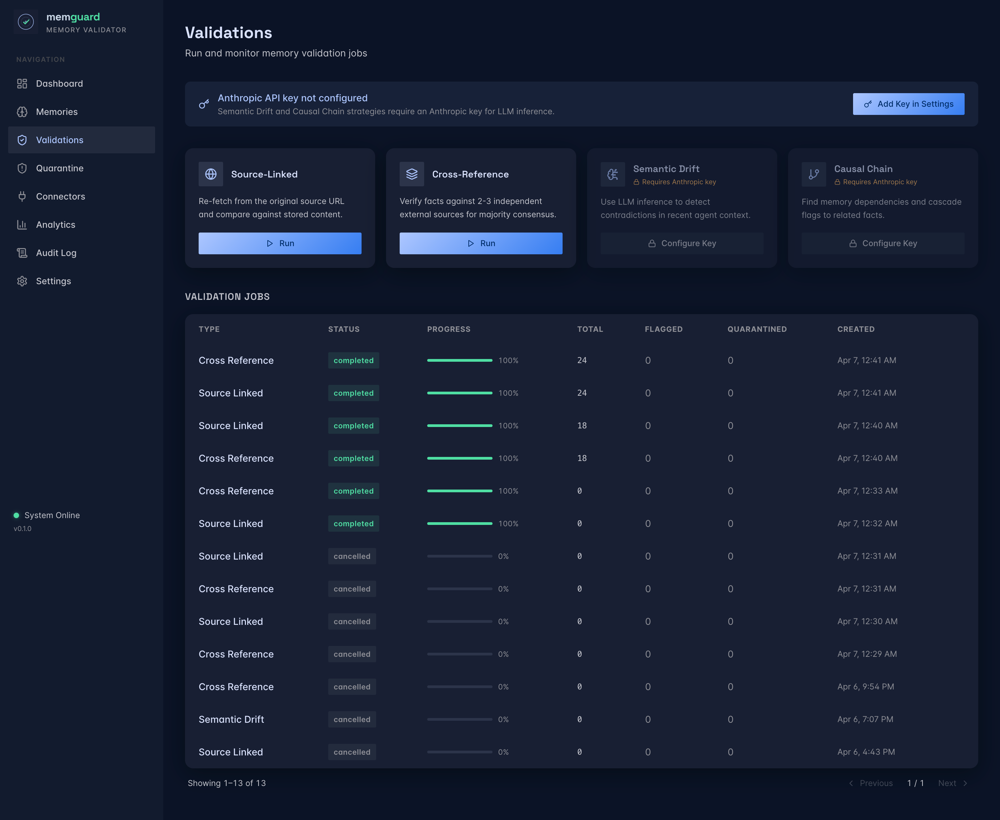
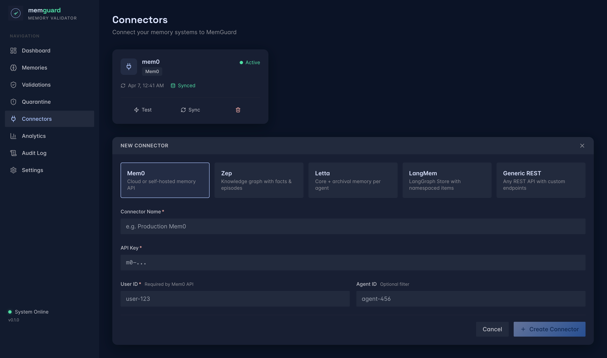
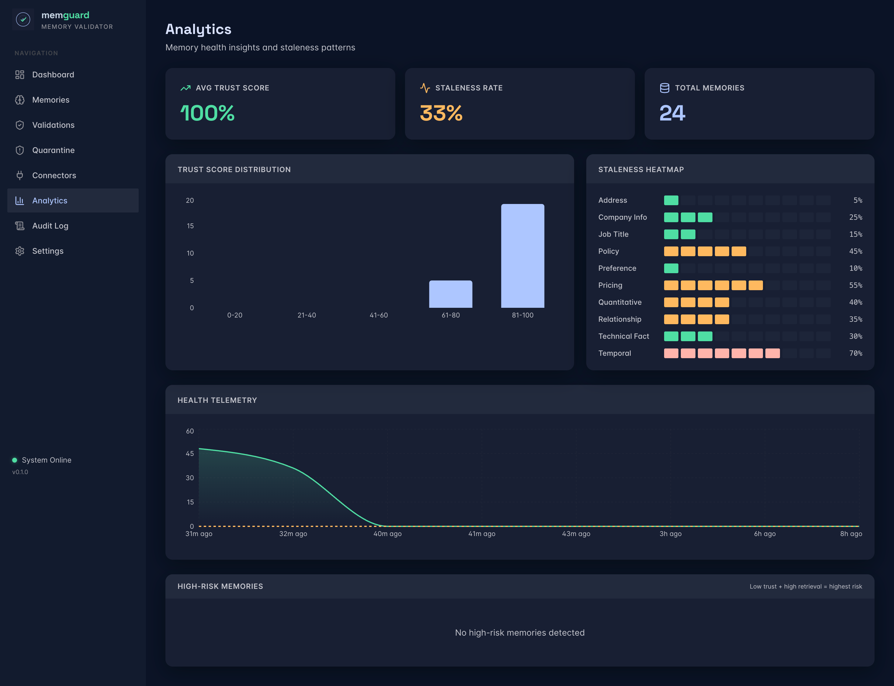
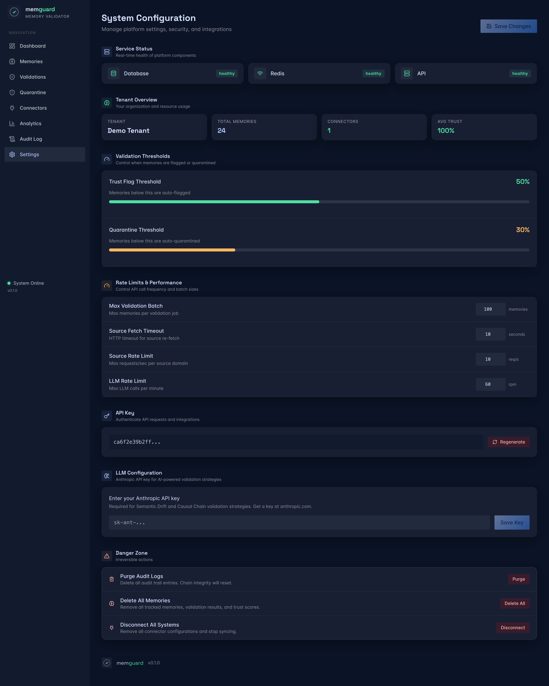

<p align="center">
  
</p>

<p align="center">
  <strong>AI Agent Memory Validation Platform</strong><br>
  Continuously verify whether facts stored in AI agent memory systems are still true.
</p>

<p align="center">
  <a href="https://github.com/ac12644/MemGuard/actions/workflows/ci.yml"></a>
  <a href="https://github.com/ac12644/MemGuard/blob/main/LICENSE"></a>
  <a href="https://www.python.org/downloads/"></a>
  <a href="https://fastapi.tiangolo.com"></a>
  <a href="https://react.dev"></a>
  <a href="https://github.com/ac12644/MemGuard/pulls"></a>
</p>

<p align="center">
  <a href="#quick-start">Quick Start</a> &middot;
  <a href="#connectors">Connectors</a> &middot;
  <a href="#validation-strategies">Strategies</a> &middot;
  <a href="#api-reference">API</a> &middot;
  <a href="#contributing">Contributing</a>
</p>

---

<p align="center">
  
</p>

## Why MemGuard?

AI agents store facts in memory systems &mdash; a user's job title, a product's price, a company's address. These facts go stale silently. The agent keeps using them with high confidence, delivering **wrong answers without any warning**.

MemGuard sits **beside** your memory system (Mem0, Zep, Letta, LangMem, or any REST API) as a sidecar that monitors, validates, and alerts &mdash; like Datadog for agent memory.

**Core insight:** Memory systems decay facts by access frequency or TTL timers. But a frequently-retrieved memory about a user's employer is highly relevant until it's wrong &mdash; then it becomes *confidently wrong* rather than just outdated. MemGuard detects this proactively.

## Screenshots

<details>
<summary><strong>Memories</strong> &mdash; Browse and filter tracked memories with trust scores</summary>
<br>

</details>

<details>
<summary><strong>Validations</strong> &mdash; Run validation strategies and monitor jobs</summary>
<br>

</details>

<details>
<summary><strong>Connectors</strong> &mdash; Connect memory systems with guided setup</summary>
<br>

</details>

<details>
<summary><strong>Analytics</strong> &mdash; Trust distribution, staleness heatmap, health telemetry</summary>
<br>

</details>

<details>
<summary><strong>Settings</strong> &mdash; Service status, thresholds, API keys, danger zone</summary>
<br>

</details>

## Quick Start

### One command with Docker

```bash
git clone https://github.com/ac12644/MemGuard.git
cd memguard
docker-compose up
```

That's it. This starts:

| Service | URL | Purpose |
|---------|-----|---------|
| Dashboard | [localhost:3000](http://localhost:3000) | Web UI |
| API | [localhost:8001](http://localhost:8001/docs) | REST API + Swagger docs |
| PostgreSQL | localhost:5433 | Database |
| Redis | localhost:6380 | Cache + task queue |
| Celery Worker | (background) | Async validation jobs |
| Celery Beat | (background) | Scheduled validation sweeps |

### First steps after startup

**1. Open the dashboard** at [http://localhost:3000](http://localhost:3000) &mdash; you'll see the onboarding checklist.

**2. Add a connector** &mdash; click Connectors in the sidebar, then "Add Connector". Pick your memory system and enter credentials.

**3. Sync memories** &mdash; click "Sync" on your connector card. Memories appear on the Memories page.

**4. Run a validation** &mdash; go to Validations, pick a strategy, click "Run".

### Register via API (optional)

```bash
# Create a tenant and get an API key
curl -X POST http://localhost:8001/api/v1/auth/register \
  -H "Content-Type: application/json" \
  -d '{"name": "My Org"}'

# Use the returned key for authenticated requests
curl http://localhost:8001/api/v1/memories/stats \
  -H "X-API-Key: mg_your_key_here"
```

> In development mode, requests without an API key auto-use a demo tenant.

## Local Development

For working on the codebase without Docker:

```bash
# Prerequisites: Python 3.12+, Node.js 20+, Docker (for Postgres/Redis)

# Start dependencies
docker-compose up -d postgres redis

# Backend
uv venv && uv pip install -e ".[dev]" psycopg2-binary
source .venv/bin/activate
alembic upgrade head
uvicorn src.main:app --reload --port 8001

# Dashboard (separate terminal)
cd dashboard && npm install && npm run dev

# Tests
pytest tests/unit/ -v              # Unit tests (no DB needed)
pytest tests/integration/ -v       # Integration tests (needs running server)
```

## Connectors

MemGuard connects to any memory system through adapters:

| Connector | What It Fetches | Writeback | Auth |
|-----------|----------------|-----------|------|
| **Mem0** | REST API memories | Yes (metadata) | API key + user_id |
| **Zep** | Knowledge graph edges + threads | No | API key |
| **Letta** | Core memory blocks + archival passages | Yes (core blocks) | Bearer token |
| **LangMem** | LangGraph Store namespaced items | Yes (item values) | LangSmith key |
| **Generic REST** | Any REST API you configure | Configurable | Configurable |

Connector secrets are **encrypted at rest** and masked in all API responses.

**Adding a new connector:** Implement the `BaseConnector` interface in `src/connectors/` and register it in `src/connectors/registry.py`.

## Validation Strategies

| Strategy | How It Works | Requires LLM | Cost |
|----------|-------------|:------------:|------|
| **Source-Linked** | Re-fetch the original source URL and compare values | No | HTTP calls |
| **Cross-Reference** | Verify against 2-3 independent sources | No | HTTP calls |
| **Temporal Pattern** | Predict staleness from statistical decay curves | No | Free |
| **Semantic Drift** | LLM detects contradictions in recent agent context | Yes | ~$0.002/memory |
| **Causal Chain** | Find memory dependencies, cascade flags | Yes | ~$0.003/memory |

> LLM strategies require an Anthropic API key. Configure it in Settings or via the `ANTHROPIC_API_KEY` environment variable. The product works fully without it &mdash; LLM strategies are optional.

### Trust Score

Every memory gets a composite trust score (0&ndash;100%) based on:

- **Source reliability** &mdash; how trustworthy is the original source
- **Freshness** &mdash; time since last validation, weighted by fact-type volatility
- **Cross-reference agreement** &mdash; do multiple sources agree
- **Historical accuracy** &mdash; track record of past validations
- **Retrieval frequency** &mdash; frequently-used memories are higher risk if stale

Memories below the **flag threshold** (default 50%) are flagged. Below the **quarantine threshold** (default 30%) they're automatically quarantined so agents stop using them.

## MCP Server

MemGuard exposes tools for AI agents via the Model Context Protocol:

```bash
python -m src.mcp.server
```

| Tool | Purpose |
|------|---------|
| `validate_memory` | Check if a specific memory is still accurate before acting on it |
| `get_memory_health` | Get overall health metrics for the agent's memory store |
| `report_stale_memory` | Report a memory the agent suspects is stale |
| `get_trusted_memories` | Retrieve only memories above a trust score threshold |

## API Reference

Full interactive docs at [localhost:8001/docs](http://localhost:8001/docs) (Swagger UI).

### Key endpoints

| Method | Path | Description |
|--------|------|-------------|
| `POST` | `/api/v1/auth/register` | Register tenant, get API key |
| `POST` | `/api/v1/auth/verify` | Verify an API key |
| `GET/POST` | `/api/v1/connectors` | List / create connectors |
| `POST` | `/api/v1/connectors/{id}/test` | Test connectivity |
| `POST` | `/api/v1/connectors/{id}/sync` | Sync memories from source |
| `GET` | `/api/v1/memories` | List memories (filterable, sortable) |
| `GET` | `/api/v1/memories/stats` | Aggregate memory stats |
| `POST` | `/api/v1/validations` | Run a validation job |
| `GET` | `/api/v1/quarantine` | List quarantined memories |
| `POST` | `/api/v1/quarantine/{id}/restore` | Restore a quarantined memory |
| `GET` | `/api/v1/analytics/health-score` | Overall memory health |
| `GET` | `/api/v1/audit` | Tamper-proof audit trail |
| `GET` | `/api/v1/audit/verify-integrity` | Verify audit chain integrity |
| `GET/PUT` | `/api/v1/settings` | Read/update tenant settings |
| `POST` | `/api/v1/webhooks` | Register webhook for events |

All `/api/v1/*` endpoints require `X-API-Key` header (except auth endpoints). In dev mode, unauthenticated requests use a demo tenant.

## Configuration

All settings can be configured via environment variables or the Settings page in the dashboard.

| Variable | Default | Description |
|----------|---------|-------------|
| `MEMGUARD_ENV` | `development` | `development` or `production` |
| `MEMGUARD_SECRET_KEY` | (required) | Encrypts connector secrets at rest |
| `DATABASE_URL` | (required) | PostgreSQL connection string |
| `REDIS_URL` | (required) | Redis connection string |
| `MEMGUARD_CORS_ORIGINS` | `*` | Comma-separated allowed origins |
| `ANTHROPIC_API_KEY` | (optional) | Enables LLM validation strategies |
| `MEMGUARD_DEFAULT_TRUST_THRESHOLD` | `0.5` | Below this = auto-flag |
| `MEMGUARD_QUARANTINE_THRESHOLD` | `0.3` | Below this = auto-quarantine |
| `MEMGUARD_MAX_VALIDATION_BATCH` | `100` | Max memories per validation job |
| `MEMGUARD_SOURCE_FETCH_TIMEOUT` | `10` | HTTP timeout in seconds |
| `MEMGUARD_SOURCE_RATE_LIMIT_PER_DOMAIN` | `10` | Requests/sec per source domain |
| `MEMGUARD_LLM_RATE_LIMIT_RPM` | `60` | LLM calls per minute |

See [`.env.production`](.env.production) for a complete template.

## Production Deployment

For deploying with auto-TLS (HTTPS), database backups, and production security:

```bash
# Set required env vars
export DOMAIN=memguard.yourdomain.com
export MEMGUARD_SECRET_KEY=$(openssl rand -hex 32)
export POSTGRES_PASSWORD=$(openssl rand -hex 16)

# Deploy with production overlay
docker-compose -f docker-compose.yml -f docker-compose.prod.yml up -d
```

This adds:
- **Caddy** reverse proxy with automatic Let's Encrypt TLS
- **Security headers** (HSTS, X-Frame-Options, CSP)
- **Automated daily backups** with 30-day retention
- **Secret key enforcement** (fails to start if default key is used)
- **Auto-restart** on all containers

### Monitoring

```bash
# Basic health
curl https://memguard.yourdomain.com/health

# Detailed health with latency metrics
curl https://memguard.yourdomain.com/health/detailed
```

### Manual Backup

```bash
./scripts/backup.sh
```

## Architecture

```
                    Dashboard (React)
                         |
                    API (FastAPI)
                    /    |    \
            Connectors  Engine  Scheduler
            /  |  |  \    |      |
        Mem0 Zep Letta  Trust   Celery
             LangMem   Score    Worker
             Generic   Calc.    Beat
                         |
                    PostgreSQL + Redis
```

### Tech Stack

| Component | Technology |
|-----------|-----------|
| Backend | Python 3.12, FastAPI, SQLAlchemy 2.0, Alembic |
| Database | PostgreSQL 16 |
| Cache/Queue | Redis 7, Celery |
| LLM | Anthropic Claude (optional) |
| Dashboard | React 18, Tailwind CSS, Vite, Recharts |
| MCP | Python MCP SDK |
| Containers | Docker, Docker Compose |

### Project Structure

```
src/
  main.py                  # FastAPI application
  config.py                # Environment-based settings
  models/                  # 10 SQLAlchemy models
  api/
    routes/                # 40 REST endpoints
    middleware.py           # Rate limiting, request logging
    deps.py                # Auth, DB session injection
    exceptions.py          # Error handling
    webhooks.py            # Event emission
  connectors/              # 5 memory system adapters
    base.py                # Abstract connector interface
    mem0.py, zep.py, ...   # Implementations
    registry.py            # Connector factory
  engine/
    validator.py           # Validation orchestrator
    trust_calculator.py    # Composite trust scoring
    fact_classifier.py     # Fact-type classification
    strategies/            # 5 validation strategies
  scheduler/               # Celery tasks + prioritizer
  quarantine/              # Quarantine + auto-remediation
  mcp/                     # MCP server (4 tools)
  utils/                   # Crypto, rate limiting, audit

dashboard/                 # React SPA (8 pages)
tests/                     # Unit + integration tests
```

## Contributing

Contributions are welcome. Please:

1. Fork the repository
2. Create a feature branch (`git checkout -b feature/my-feature`)
3. Run tests (`pytest tests/unit/ -v`)
4. Open a pull request

### Development guidelines

- **Async everywhere** &mdash; all DB and HTTP operations use `async/await`
- **Type hints** &mdash; every function has full type annotations
- **No raw SQL** &mdash; use SQLAlchemy ORM
- **Tests** &mdash; every new module gets a test file
- **120 char line length** &mdash; enforced by Ruff
- **Naming** &mdash; `snake_case` for Python, `camelCase` for TypeScript

## License

```
Copyright 2026 MemGuard Contributors

Licensed under the Apache License, Version 2.0 (the "License");
you may not use this file except in compliance with the License.
You may obtain a copy of the License at

    http://www.apache.org/licenses/LICENSE-2.0

Unless required by applicable law or agreed to in writing, software
distributed under the License is distributed on an "AS IS" BASIS,
WITHOUT WARRANTIES OR CONDITIONS OF ANY KIND, either express or implied.
See the License for the specific language governing permissions and
limitations under the License.
```
